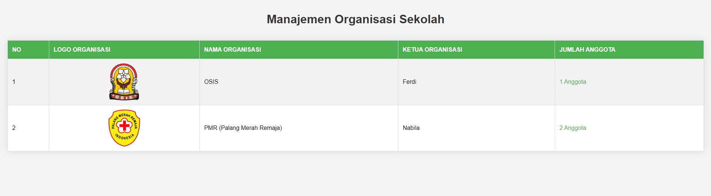

# Sistem Manajemen Organisasi Sekolah

Sistem Manajemen Organisasi Sekolah adalah aplikasi berbasis web yang memungkinkan pengguna untuk mengelola data organisasi dan anggota organisasi di lingkungan sekolah.


## Fitur

- Menampilkan daftar organisasi sekolah
- Mengelola data organisasi (tambah, edit, hapus)
- Mengelola data anggota organisasi (tambah, edit, hapus)
- Mengunggah dan menampilkan logo organisasi
- Menampilkan jumlah anggota untuk setiap organisasi

## Teknologi yang Digunakan

- PHP
- SQLite
- HTML
- CSS

## Cara Instalasi

1. Pastikan Anda memiliki web server (seperti Apache) dan PHP yang terinstal di komputer Anda.
2. Clone repositori ini ke direktori web server Anda:
```
git clone https://github.com/username/Manajemen_organisasi.git
```
3. Buat folder `Logo_organisasi` di dalam direktori proyek dan pastikan web server memiliki izin untuk menulis ke folder ini.
4. Akses aplikasi melalui browser web Anda (misalnya: `http://localhost/sistem-manajemen-organisasi-sekolah`).

## Struktur File

- `index.php`: Halaman utama yang menampilkan daftar organisasi
- `admin.php`: Halaman admin untuk mengelola data organisasi
- `admin_anggota.php`: Halaman admin untuk mengelola data anggota organisasi
- `read_anggota.php`: Halaman untuk menampilkan daftar anggota suatu organisasi
- `function.php`: File yang berisi fungsi-fungsi utama aplikasi
- `css/style.css`: File CSS untuk styling aplikasi
- `database.sqlite`: File database SQLite

## Penggunaan

1. Buka halaman utama (`index.php`) untuk melihat daftar organisasi.
2. Untuk mengelola data organisasi, akses halaman admin (`admin.php`).
3. Untuk mengelola data anggota, akses halaman admin anggota (`admin_anggota.php`).
4. Klik pada jumlah anggota di halaman utama untuk melihat daftar anggota suatu organisasi.

## Kontribusi

Jika Anda ingin berkontribusi pada proyek ini, silakan fork repositori ini, buat perubahan, dan ajukan pull request.

## Lisensi

Proyek ini dilisensikan di bawah [MIT License](LICENSE).

## Kontak

Jika Anda memiliki pertanyaan atau masukan, silakan hubungi [nama Anda] di [alamat email Anda].